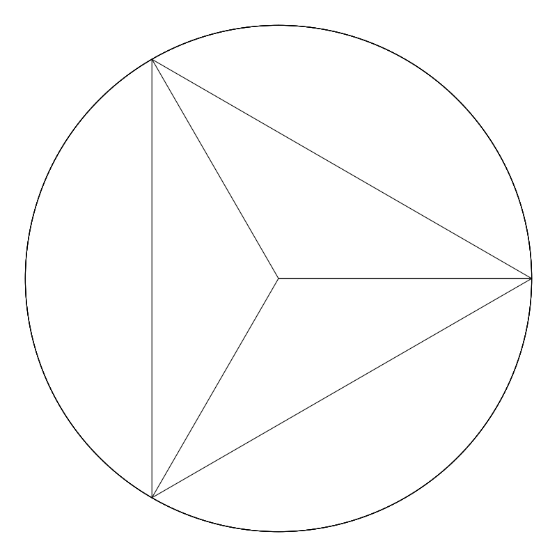
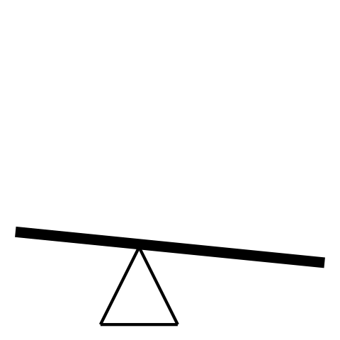
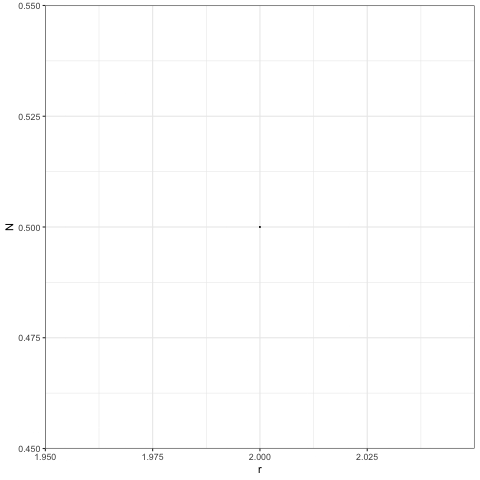

```{r setup, include=FALSE}
library(tufte)
# invalidate cache when the tufte version changes
knitr::opts_chunk$set(cache.extra = packageVersion('tufte'))
options(htmltools.dir.version = FALSE)
```

# Outline

-   The essentials

-   Numerical approximations

    -   Approximating $\pi$

    -   What do you **mean**?

-   Pseudorandom numbers, logistic map, and chaos!?

-   Simulating ecology

    -   Ecological communities

    -   Species interactions & coexistence

```{r, echo = FALSE, include = FALSE, message = FALSE}
library(ggplot2)
library(dplyr)
library(tidyr)
library(emo)
```

# The essentials

*Note: This workshop is about simulations and not programming. Don't worry about the details but rather, focus on building intuition and a mental model*

There are only a couple things you will need to run a simulation: 1) generate a sequence of numbers, 2) have some way to store data, 3) be able to manipulate that data, and 4) have **imagination** `r ji("smile")`

## 1. Sequence of numbers

Before any simulation can happen, we need to a generate some numbers or a range of numbers. Think about it as the "spacetime" or canvas in which the reality of your simulation unfolds. Often times this is a sequence of ordered integers or a random sequence of numbers drawn from some probability distribution.

These are the commonly used functions that you can to generate such numbers in R:

-   **Ordered sequence**: seq()

-   **Random sequence**

    -   Uniform distribution: runif()

    -   Normal distribution: rnorm()

Examples

```{r}
seq(from = 1, to = 10, by = 2)
runif(n = 5, min = 0, max = 1)
rnorm(n = 5, mean = 5, sd = 1)
```

## 2. Storing your data

Once we have generated some numbers and also when we run the actual simulation, we need to have some way to store the data.

In R, the commonly used data structures are:

-   **Vectors** - a sequence of items of the same type (integers, numerics, characters)

    ```{r}
    vec <- c(1, 2, 3)
    vec
    ```

-   **Matrices** or Arrays - generalization of vectors in multiple dimensions

    ```{r}
    mat <- matrix(data = 1:9, nrow = 3, ncol = 3)
    mat
    ```

-   **Data frames** - a collection of variables organized in a table. Each column is a variable and each row is an observation/datum

    ```{r}
    df <- data.frame(varA = c(1, 5, 10), varB = c('blue', 'red', 'green'))
    df
    ```

-   **Lists** - the "meta" data structure, can store objects of any type. Can be a list of lists, a list vectors, list of dataframes, or a list of different combinations of data structures!

    ```{r}
    list(vec, mat, df)
    ```

## 3. Loops

In general, loops are used to do *repetitive* tasks. Although R has some ways of doing repetitive tasks without loops (via vectorized operations), loops are particularly useful for iterating functions that are ***time-dependent***. If your simulation has some time-dependent component, use loops! The two types of loops you can do are `for loops` and `while loops`. Sometimes either approach can work, but the main difference between them is that with `for loops` you usually know *a priori* the number of iterations your program will run. However, sometimes you don't know how many iterations your program will run for. Instead, you might have some *condition* or criteria that you will use to determine when to stop a program (e.g. accuracy of approximation).

-   **For loops** - iterates (*i* ) through some *sequence* and applies some function for each iteration

    ```{r, eval = FALSE}

    for (i in 1:length(vec)){
      print(vec[i])
    }
    ```

-   **While loops** - while conditions is true, keep iterating

    ```{r, eval = FALSE}
    val <- 1
    while (val < 10){
      #some function
      do_this
      #update test variable  
      val <- val + 1
    }
    ```

## 4. Imagination

Some inspiration from the great explainer

> "Our imagination is stretched to the utmost, not, as in fiction, to imagine things which are not really there, but just to comprehend those things which are there." -Richard Feynman

<br>

<br>

# Numerical approximations

Sometimes an analytical solution is hard to derive or is simply not available. One way to get around this is to approximate a solution by doing what we ***already know***.

## Approximating pi

Believe it or not, mathematics used to be an experimental science. Before the the concept of infinity or calculus was a thing, people had no way of dealing with ***curves***. But curves are everywhere! To estimate the circumference of a circle, the Greek polymath **Archimedes** started by fitting a hexagon (a shape with straight lines!) inside a circle. Since he knew the distance between the corners of the polygon to the center of the circle is equal to the radius (r), he can apply *Pythagorean's theorem* to get the distance between those corners. Summing up those distances would then give an approximation of the circle's circumference. But the approximation of a hexagon is crude. Instead, Archimedes continued adding more edges to the polygon, and with each added edge, the approximation gets closer and closer to the actual value.

Instead of drawing polygons and solving the Pythagorean's equation by hand(!), we can now have computers do it for us!

```{r, fig.align= "center", out.width = "50%", echo = FALSE}

```

## Activity 1: Approximating $\pi$

Suppose we have a unit circle enclosed within a unit square, like so:

```{r, echo = FALSE, fig.align = 'center', fig.width=5,fig.height=5, message=FALSE}
circle_square_p <- ggplot()+
  ggforce::geom_circle(aes(x0 = 0.5, y0 = 0.5, r = 0.5), size = 0.5)+
  geom_rect(mapping=aes(xmin=0, xmax=1, ymin=0, ymax=1),fill = NA, color="black", alpha=0.5) + theme_bw() + lims( x = c(0, 1.1), y = c(0, 1.1))

circle_square_p +
  geom_line(aes(x = c(0.5,1), y = c(0.5,0.5)))+
  geom_line(aes(x = c(0,1), y = c(1.05, 1.05)))+
  geom_text(aes(x = c(0.5, 0.75), y = c(1.08, 0.53), label = c('2r = 1', 'r  = 0.5')), size = 5)+
  theme_void()
```

It is said that the value of $\pi$ is equal to 4 times the ratio between the circle's area and the square's area:

$$
\pi = 4 * \frac{Area_{circle}}{Area_{square}}
$$

Obviously, anyone who's taken elementary geometry would tell you "but we need $\pi$ to get the area of the circle!" Instead of using equations, we can *fill up* the space (that make up the shapes) with quantities that we already know and use that to approximate area. Like estimating the volume of a vase by adding water from a graduated cylinder. Instead of water, we can fill up that space with points of data on a computer. For example, we can use the `seq()` function to *fill up* the *space* between 0 and 1, and the amount of points within that range gives us some quantitative information about the space. Since the circle is smaller than the square, some points will lie within the circle while some are outside. The number of points that lie within and outside of the circle therefore gives us an approximation of the ratio between the area of the circle and the square. The more points we use, the closer we are to the actual value. Just as we can fill our vase with discrete and coarse objects like marbles, pebbles, or coins, instead of water. Coarser objects simply reduces the resolution of our approximation.

```{r, message=FALSE}
res <- 100 #resolution; the higher the better the approximation
points  <- seq(from = 0, to  = 1, length.out = res)
xy_points <- expand.grid(x = points, y = points) #gives a pairwise combination of each value
       
#Plot with points                    
circle_square_p +
  geom_point(data = xy_points, aes(x = x, y = y), size = 0.5, alpha = 0.3)+
  lims(x = c(0, 1), y = c(0,1))
```

To check whether a point lies within the circle, we can use equation of the circle:

$$
(x - x_o)^2 + (y - y_o)^2 = r^2
$$

$$
(x - 0.5)^2 + (y - 0.5)^2 = 0.5^2
$$

$$
\sqrt((x−0.5)^2+(y−0.5)^2) = 0.5
$$

Any point that gives a value greater than $r$ (or 0.5) would lie **outside** of the circle. To implement this, we simply substitute the x and y with our "data" (apply the LHS of the equation), and check whether each result is \< than 0.5.

```{r}
approx_pi_fun <- function(n = 100){
  
  #Number of points used to approximate
  points  <- seq(from = 0, to  = 1, length.out = n)
  
  #Expand it to span 2 dimenisons (x and y)
  xy_points <- expand.grid(x = points, y = points) 
  
  #Check whether points are within circle
  area_with_points <- xy_points%>%
  mutate(distance_to_center = sqrt((x-0.5)^2 + (y-0.5)^2))%>% #circle equation
  mutate(in_circle = ifelse(distance_to_center < 0.5, yes = 1, no = 0))
#check condition
  
  #Number of points inside square
  area_square <- n*n #all points should be within square 
  area_circle <- sum(area_with_points$in_circle) #sum up all the 1s
  
  #Approximate pi
  approx_pi <- 4*(area_circle/area_square)
  return(approx_pi)
    
}


approx_pi_fun(n = 100)
```

**Task 1a**: Use the `approx_pi_fun()` function and apply it to varying levels of sample sizes (*n*) and see how the approximation of $\pi$ changes

```{r, echo = FALSE}
#I. Generate a sequece of values: these will be your "ns"
n_vals <- seq(from = 100, to = 2000, by = 100) #these need to be integer values

#II. Apply approx_pi_fun() to each element of the sequence
pi_experiment <- data.frame(n = n_vals)%>%
  rowwise()%>% #ensures that operations are done on a rowwise basis 
  mutate(pi = approx_pi_fun(n = n)) #for each row, pi = approx_pi_fun(n)

#option 1: loops
#option 2: rowwise() + mutate() from dplyr
#option 3: sapply()
#option 4: ?


#III. Visualize output
pi_experiment%>%
  ggplot(aes(x = n, y = pi))+
  geom_point()+
  geom_line()+
  geom_hline(yintercept = pi)+ #reference line showing the true value
  theme_bw()
```

**Task 1b**: Instead of using `seq()` can you think of a *stochastic* way of approximating pi? Imagine throwing darts and adding up the darts that lie within and outside of the circle.

```{marginfigure}
 Hint: draw from a probability distribution but think about which one specifically
```

```{r}
# #I. take random shots with "equal probablity" within the unit square
# 
# # random_darts <- data.frame(x = some distribution b/w 0 and 1,
# #                            y = some distribution b/w 0 and 1)
# 
# #Check where darts lie
# pi_exp2 <- random_darts%>%
#   mutate(distance_to_center = sqrt((x-0.5)^2 + (y-0.5)^2))%>% #circle equation
#   mutate(in_circle = ifelse(distance_to_center < 0.5, yes = 1, no = 0))
# 
# #Approximate value of pi
# # No. of points inside circle 
# # No. of points inside square
# # ratio * 4

```

<br>

<br>

# What do you "mean"?

I think it's safe to say that we all know what the *mean* (or average) is. It's a summary statistic (a single value) that best represents a set of values `r margin_note('From Wikipedia: "[The mean] is a central value of a finite set of numbers"')`. And you probably also know the formula for it:

$$
\overline{x} = \frac{\sum_{i = 1}^{N}x_i}{N}
$$

But **WHY**!?

We can think of the mean in more *physical* terms: the "center of mass". In seesaw language, that means the left and the right side of the fulcrum have the same mass; they are balanced:

```{r, fig.align= "center", out.width = "50%", echo = FALSE}

```

One way we can quantify the *centerness* of a particular point is by calculating the distances between that point to the *N* points in a set of values.

$$
f(\overline{x}) = \sum_{i = 1}^{N}(x_i - \overline{x})^2
$$

If a point is centered, then the distances to the left should be balanced by the distances to the right. Squaring ensures the distances are all positive (as you may have been told before) but it also does something very special.

## Activity 2: Approximating statistical parameters numerically

**Task 2.** Using the sum of squares (SS) equation, calculate the SS for a range of *possible* means of a random variable

```{r}

#Sample the values of a random variable
set.seed(10)
rand <- runif(30)

#Sum of square function
ss_fun <- function(xi, xhat){
  
  #Desired output: Sum of squares as a function of xhat 
  
  #output should be a vector of length = length(xhat)
  sum_of_squares <- vector(mode = 'numeric', length = length(xhat))
  
  #Loop through each xhat and compute it Sum of squares
  #SS for each xhat
  for(i in 1:length(xhat)){
    squares <- (xi - xhat[i])^2 #compute the squares
    sum_of_squares[i] <- sum(squares) #sum the squares and save the value
  }
  
  return(sum_of_squares)
}

#Generate a sequence of "possible" means
possible_means <- seq(0, 1, length.out = 10)

#Apply SS function to get SS for each xhat
ss <- ss_fun(xi = rand, xhat = possible_means)

#Plot
data.frame(SumOfSquares = ss, possible_mean = possible_means)%>%
  mutate(Minimum = ifelse(min(SumOfSquares) == SumOfSquares, TRUE, FALSE))%>%
  ggplot(aes(x = possible_mean, y = SumOfSquares))+
  geom_line()+
  geom_point(aes(col = Minimum))+
  geom_vline(xintercept = mean(rand))+
  labs(y = "Sum of Squares", x = "Candidate mean")+
  theme_bw()

#Experiment with the number of possible means and see what happens to the plot
```

```{marginfigure}
Apply the chain rule to find the derivative of the SS function. Derivative of sum function is 2 and derivative of $\overline{x}$ inside the sum function is -1: 

$$SS = f(\overline{x}) ={\sum_{i = 1}^{N}(x_i-\overline{x})^2}$$

$$\frac{\partial f}{\partial \overline{x}} = \sum_{i = 1}^{N} 2(x_{i} - \overline{x} )(-1)$$

$$0 = -\sum_{i = 1}^{N}(2x_{i} - 2\overline{x})$$

$$= 2\sum_{i = 1}^{N}(x_{i}) - 2\overline{x}\sum_{i = 1}^{N}1$$

$$= 2\sum_{i = 1}^{N}(x_{i}) - 2\overline{x}$$

$$2\overline{x}N= 2\sum_{i = 1}^{N}(x_{i})$$

$$\overline{x}= \frac{\sum_{i = 1}^{N}(x_{i})}{N}$$
```

Notice that the resulting function is a **curve** and that the **minimum** of that curve lies the actual mean. Knowing this, and a bit of calculus, is there anything "special" about the minimum point that you can say? What can we do with that information?

<br>

<br>

# Pseudorandom numbers, logistic map, and chaos

Despite claims of a deterministic universe (Sakarchi 2021, *personal communication*), **random numbers** are central to sooo many things (e.g. statistics, Monte Carlo methods, cryptography, ecology & evolution(!)). In computers, we use it all the time without even thinking about it. How is it that every time we call `rnorm(1)` , the computer gives us a number that we have no way of knowing *a priori*? How is it possible for a *deterministic* system (i.e. a computer) to generate random numbers? In fact, it actually is *impossible* for a computer to generate truly random numbers. The solution is to generate something that are *random-like*, hence *pseudo*. Enter ***chaos***, a deterministic phenomenon with irregular (random-like) behavior.

Strictly speaking, chaos is a type of attractor (or equilibrium dynamic) of a dynamical system. A kind of *equilibrium* just like the carrying capacities of single species pop'n growth and limit cycles in predator-prey systems. It is similar to carrying capacities and limit cycles in the sense that it is *bounded* and the trajectories of the state variable/s will always be within a range of values; if you perturb it, it will go back to the bounded trajectory. The difference however, and this is why they are useful for generating random numbers, is because it has these two characteristics:

-   **Sensitivity to initial conditions** - given two identical chaotic system (i.e. same governing equation), even the slightest difference in their initial conditions will cause them to diverge. BUT if they are exactly the same, the trajectory will be exactly the same

-   **Aperiodic** - although the trajectories are bounded, it never repeats itself

Many dynamical systems can give rise to chaotic dynamics, think double pendulums, the weather, and of course, ecology. Although chaos is more likely to arise in complicated systems (with many interacting components), they can nonetheless arise in the simplest non-linear dynamical system: the **logistic map**, or population growth with non-overlapping generations popularized by Robert May.

This is the equation:

$$
N_{t+1} = rN_{t}(1-N_{t})
$$

It is shown that different values of $r$ (i.e. intrinsic growth rate), can give rise to fixed-point equilibrium, limit cycles, and chaos:

```{r, fig.align= "center", out.width = "50%", echo = FALSE}

```

## Activity 3. Create a pseudorandom generator by harnessing chaos

**Task 3a:** Convert the logistic map equation into a computer function/program

```{marginfigure}
Hint: What arguments would that function have? What is the population size at time t+1 determined by?
```

```{r, echo = FALSE}
logistic_map <- function(N0, r, timesteps){

   #Initiate a vector to store values the values of N at each timestep
   N <- vector(mode = 'numeric', length = timesteps+1) #a vector of 0's

   #Initiate the vector with an initial condition (i.e. what is the N at time = 0)
   N[1] <- N0

   #Update each element (except the first) by iterating through the vector
   for(t in 1:timesteps){
     N[t+1] <- r * N[t] * (1 - N[t])
   }

   return(N)
 }

#Test
# logistic_map(r = 4, N0 = 0.5, timesteps = 20)%>%
#   plot(type = 'line')
```

Lets take a look at the dynamics of the system with different values of $r$:

```{r}
#Values of r
rs <- c(1.5, 2.5, 3.3, 4)

#Apply each to logistic map function
out <- lapply(rs, function(x)logistic_map(r = x, N0 = 0.3, timesteps = 30))%>%
  setNames(nm = rs)%>%
  bind_rows(.id = 'r')%>%
  tibble::rowid_to_column(var = 'time')%>%
  pivot_longer(cols = -1, names_to = 'r', values_to = 'N')

#Plot
out%>%
  ggplot(aes(x = time, y = N))+
  geom_line()+
  facet_wrap(~r)+
  theme_bw()
```

What is similar and what is different about the resulting dynamics?

The simulation above only shows how the periodicity among different values of $r$. Let's now see what it means to exhibit sensitivity to initial conditions:

Here is an an example with varying N0 for the system with r = 1.5:

```{r}
#Set of initial conditions
N0 <- seq(from = 0.3, to = 0.4, length.out = 5)

#Apply each N0 to logistic_map(r = 1.5)
lmap_stable <- lapply(N0, function(x)logistic_map(r = 1.5, N0 = x, timesteps = 30))%>%
  setNames(nm = N0)%>%
  bind_rows(.id = 'N0')%>%
  tibble::rowid_to_column(var = 'time')%>%
  pivot_longer(cols = -1, names_to = 'N0', values_to = "N")%>%
  mutate(N0 = as.numeric(N0))

#Plot
lmap_stable%>%
  ggplot(aes(x = time, y = N, group = N0, col = N0))+
   scale_color_continuous(type = "gradient")+
   geom_line()+
   theme_bw()
```

**Task 3b:** Modify the code above and see what happens when we change $r$ to 4.

```{r, echo = FALSE}
#Set of initial conditions
N0 <- seq(from = 0.3, to = 0.4, length.out = 5)

#Apply each N0 to logistic_map(r = 4)
lmap_chaos <- lapply(N0, function(x)logistic_map(r = 4, N0 = x, timesteps = 30))%>%
  setNames(nm = N0)%>%
  bind_rows(.id = 'N0')%>%
  tibble::rowid_to_column(var = 'time')%>%
  pivot_longer(cols = -1, names_to = 'N0', values_to = "N")%>%
  mutate(N0 = as.numeric(N0))

#Plot
 lmap_chaos%>%
   ggplot(aes(x = time, y = N, col = N0, group = N0))+
   scale_color_continuous(type = "gradient")+
   geom_line()+
   theme_bw()
```

As you can see, the trajectory of a chaotic system is highly dependent on initial conditions. If we know the initial conditions, then we know exactly how the system will progress. In other words, every time we simulate the chaotic system with N0 = 0.3, it will always be the exact same solution. In that sense, there is nothing *random* about it! So going back to our original question, how is it that `rnorm(1)` gives us a different value every single time? If the chaotic system is "seeded" with a random initial condition, can we really say that the sequence of numbers are random. So how do we *seed it* with something "random"?

**Coupling randomness w/ deterministic chaos**

```{r}
#Generate a random seed
random_seed <- format(Sys.time(), "%OS5")%>%
  substr(start = 3, stop = 7)%>%
  as.numeric

#Use the seed as initial condition
logistic_map(r = 4, N0 = random_seed, timesteps = 30)%>%
  tail(20)%>% #remove transient
  order() #ignore the values and just look at their order
```

Let's apply the CLT to see if we can convert a chaotic system into a Gaussian random variable.

The **Central Limit Theorem** states that when *independent random variables* are summed up, the distribution of those summed statistics will approximate a normal distribution.

We can "simulate" independent variables by dividing up a single chaotic series into chunks, we assume that each *chunk* represents an independent variable.

**Task 3c.** Using chaos coupled with a random seed and the CLT, create a random variable that follows a normal distribution.

```{r, figures-side, fig.show="hold", out.width="50%", echo = FALSE}
#From chaos to CLT
ind_variables <- 300 #number of independent variables
n_of_variables <- 20 #sample size of variables

#FUNCTION: Chaos with random seed
random_chaos <- function(n = 20, burn_in = 10){
  random_seed <- format(Sys.time(), "%OS7")%>%
    substr(start = 3, stop = 9)%>%
    as.numeric
  
  out <- logistic_map(r = 4, N0 = random_seed, timesteps = n+burn_in)%>%
    tail(n) #remove transient dynamics
  # 
  return(out)
}

#Store chaotic series in a matrix, each "col" becomes a "variable"
#number of columns will be equal to the number of random samples
chaotic_matrix <- matrix(random_chaos(n = n_of_variables*ind_variables), nrow = 20)


################################################################
#Summarise those random samples: use mean, sum, or var

#Option 1: Apply
gaussian <- apply(chaotic_matrix, 2, mean) 

#Option 2: For loop 
# gaussian <- c()
# for(i in 1:ncol(chaotic_matrix)){
#   gaussian[i] <- chaotic_matrix[,i]%>%
#     mean()
# }

#Visualize result
gaussian%>%hist() #distribution
gaussian%>%plot() #equal variance
```

<br>

<br>

# Simulating ecology

## Ecological communities

```{marginfigure}
*Obviously this isn't true because of dispersal, competition, and niche construction!
```

An ecological community is a collection of species in a given place/time. The question that most of us are interested in is, why do species occur where they do? The simplest, knee-jerk, answer is that species occurrences are determined by the environment\*. That is, different species are adapted to different environmental conditions. Because there is some overlap in environmental requirements, some species will co-occur while some do not. The patterns of co-occurrence among species along environmental gradients therefore determine diversity patterns.

The simplest way to model species responses to environmental conditions is to assume that their fitness is a function of the environment (x) that follows a Gaussian distribution:

$$
Fitness(x) = re^{-\frac{(optima-x)^2}{2\sigma^2}}
$$

$r$, $optima$ and $\sigma$ are species-specific parameters that tell us their **maximum growth rate**, **environmental optima**, and their **tolerance** to environmental conditions (i.e. niche width), respectively.

```{r}
#Gaussian response curve
response_curves <- function(x, optima, niche_width, max_r = 1, plot = FALSE){
  
  out <- max_r*exp(-((optima - x)/(2*niche_width))^2)

  if(plot == TRUE){
    p <- data.frame(Env = x,
                    Response = out)%>%
      ggplot(aes(x = Env, y = Response))+
      geom_line()+
      theme_bw()
    return(p)
    
  }else{
    return(out)
  }
  
}
#Example
response_curves(x = seq(from = 0, to = 1, length.out = 100), optima = 0.4,
                niche_width = 0.1, max_r = 1, plot = TRUE) +
  labs(y = 'Fitness', x = "Environmental condition")
```

However, usually when we conduct ecological surveys or censuses, we're not actually measuring "fitness" directly. We often make the simplifying assumption that their occurrences are a good proxy or *correlate* of fitness. That is, we can think of our sampling as a series of ***Bernouilli*** or ***Binomial trials*** with the probability of observation proportional to fitness. For simplicity, let's assume that fitness maps 1:1 to probability of detection.

```{r, message=FALSE}
#Environmental gradient
env <- seq(from = 0, to = 1, length.out = 100)

#Fitness of Sp1
sp1 <- response_curves(x = env, optima = 0.4, niche_width = 0.1, max_r = 1)

#Sampling of Sp1 along env gradient
sp1_samples <- rbinom(n = length(env), size = 1, prob = sp1)

#Visualize
data.frame(Env = env, Fitness = sp1, Observation = sp1_samples)%>%
  ggplot(aes(x = Env))+
  geom_line(aes(y = Fitness), size = 2)+
  geom_point(aes(y = Observation), col = 'grey')+
  geom_smooth(aes(x = Env, y = Observation), method = 'gam', linetype = 0, 
              method.args=list(family="binomial"))+
  theme_bw()
```

Now that we know how to simulate the response of a single species, we simply do it for multiple species (w/ different values of $r$, $optima$, $\sigma$ ) and Voila, an "**ecological community**"!

```{r, echo = FALSE, warning=FALSE}
sim_comm <- function(no_spp, optima, niche_width, max_r, env, response = TRUE){

  #Spp names (for aesthetics)
  spp_names <- paste0(rep('Sp', no_spp), seq(1, no_spp))
  
  #Species parameters
  spp_parameters <- data.frame(optima = optima, #species optimas
                               niche_width = niche_width, #niche widths
                               max_r = max_r) #growth rates
  #Responses
  spp_responses <- spp_parameters%>%
    apply(., 1, function(x)response_curves(x = Env, 
                                           optima = x[1],
                                           niche_width = x[2], 
                                           max_r = x[3]))%>%
    as_tibble()%>%
    setNames(nm = spp_names)%>%
    cbind(Environment = Env, .)
  
  #If reponse == TRUE, return responses If false, return samples
  if(response == TRUE){
    return(spp_responses)
  }else{
    
    #Convert responses to samples
    spp_samples <- spp_responses%>%
      apply(1, function(x)rbinom(n = no_spp, size = 1, prob = x))%>%
      t()%>%
      as_tibble()%>%
      setNames(nm = spp_names)%>%
      cbind(Environment = Env, .)
    
    
    return(spp_samples)
  }
  
} 

#Example
Env <- seq(from = 0, to = 1, length.out = 200) 

sim_comm(no_spp = 10, env = Env,
         optima = runif(10),
         niche_width = 0.1,
         max_r = 1,
         response = TRUE)%>%
  pivot_longer(cols = -1, names_to = 'Species', values_to = 'Response')%>%
  ggplot(aes(x = Environment, y = Response, group = Species, col = Species))+
  geom_line()+
  theme_bw()+guides(col = "none")

```

## Activity 4. The mid-domain effect

We live in a spatially constrained world. We can only fit so much books in our backpacks, people in lecture halls, and food in our tummy. It's no surprise that these **spatial constraints also leave their mark on the abundance and distribution of species**. In this section, we will look at how ecological patterns can be influenced by spatial constraints of the system.

One such example of a spatial (or geographical) constraint is the **mid-domain effect**, which is the phenomenon in which species richness tend to be highest at the middle of a bounded geographic domain for solely stochastic reasons. It is "stochastic" in the sense that it has nothing to do with the actual environment conditions. The figure below from Colwell & Lees (2000) is a simulation showing how the range size of species influences the location in which species richness peaks within a bounded domain.

```{marginfigure}
Adapted from Colwell & Lees (2000)
```

```{r, fig.align= "center", out.width = "50%", echo = FALSE}
knitr::include_graphics("mid-domain.png")
```

The intuition is this:

Imagine that we are sampling **trees** and **temperature** along an **elevational gradient**. As we go up the mountain, we start seeing a turnover in species composition. Some species are no longer observed and new species start to show up. After looking at your data, you notice that species richness peaks somewhere around the middle of the elevational range

```{r, echo = FALSE}
#Simulate some data
ele_richness <- data.frame(Elevation = seq(from = 0, to = 3000, length.out = 100))%>%
  mutate(Richness = response_curves(x = Elevation/3000,
                                    optima = 0.4, niche_width = 0.5))%>%
  mutate(Richness = Richness * 70 + rnorm(100, sd = 3))%>%
  mutate(Temperature = seq(from = 28, to = 6, length.out = 100)+rnorm(100))

#Plot
ele_richness%>%
  ggplot(aes(x = Elevation, y = Richness, col = Temperature))+
  geom_point(size = 3)+
  scale_color_gradient2(high = 'red')+
  labs(x = 'Elevation (m)')+
  theme_bw()
```

**Assuming niche width is the same across all species**, we might infer that species (and their optimas) are sorted by temperature along the elevational gradient. We might also make the conclusion that species richness is highest at intermediate temperature conditions since most of species optimas occur around that region.

**Temperature -\> Species optimas -\> Richness**

However, as Colwell & Lees show, richness pattern can be **unrelated to environmental conditions** (i.e. unrelated to deterministic processes) and may solely be due to inherent spatial/geographic boundaries of the system. Furthermore, they show that species ranges can influence the strength of this alternative, stochastic process. In other words, Colwell & Lees show that in a bounded region, richness peeks will emerge:

-   **without any environmental effects** and that the
-   **probability of finding a peak in the middle is related to species ranges**

Let's try and see if we can reproduce the results of Colwell & Lees. To do so, we will:

-   **Randomize species optimas** along the gradient (removes environmental effects)

-   **Vary the size of species ranges** (or niche widths)

**Task 4a.** Using the `sim_comm()` function, simulate multiple ecological communities along an environmental gradient with 500 `niche_width` values from 0.01 to 0.2. Use only a single niche width value for each simulation (There should be a total of 500 simulated communities).

Use these parameter values for all simulations:

-   `env` with a gradient length of 100 between 0 and 1

-   `no_spp` = 200

-   random and uniformly distributed `optima` between 0 and 1

-   `max_r` = 0.7

-   set `response = FALSE`

```{r, echo = FALSE}
#Initiate constant paramters
Env <- seq(from = 0, to = 1, length.out = 100) 
no_spp <- 200

#Paramter to vary
niche_widths <- seq(from = 0, to = 0.2, length.out = 500)

#Simulate communities -----
#iniate data structure for storing data
simulated_comm <- list()

#iterate
for(i in 1:length(niche_widths)){
  
  #Draw species optimas randomly
  opt <- runif(n = no_spp) 
  
  #Simulate
  simulated_comm[[i]] <- sim_comm(no_spp = no_spp, env = Env,
                                  optima = opt, 
                                  niche_width = niche_widths[i], 
                                  max_r = 0.7, response = FALSE)
}

```

Let's now look at the location of the species richness peaks of these communities

```{r, echo = FALSE, out.width = "50%",}
simm_comm_df <- simulated_comm%>%
  bind_rows()%>%
  mutate(niche_width = rep(niche_widths, each = length(Env)))%>%
  mutate(Richness = rowSums(select(., starts_with("Sp"))))%>%
  mutate(niche_width = as.numeric(niche_width))%>%
  select(niche_width, Environment, Richness)


#Richness patterns
simm_comm_df%>%
  ggplot(aes(x = Environment, y = Richness))+
  geom_point(aes(col = niche_width))+
  scale_color_gradient(name = 'Niche width')+
  theme_bw()

#Peak richess----
#group by niche_width and filter rows by max value of richness
rich_peak_df <- simm_comm_df%>%
  group_by(niche_width)%>%
  slice(which.max(Richness))

rich_peak_df%>%
  ggplot(aes(x = Environment, y = niche_width))+
  geom_point(size = 3, alpha = 0.7)+
  labs(y = 'Niche width', x = 'Richness Peak')+
  theme_bw()

```

Close enough? Maybe?

<br>

<br>

## Species interactions & coexistence

The rules of life (as we know it) are governed by dynamical equations. All organisms consume resource, grow, and move at specific **rates.** In so doing, they also modify the rates (i.e. interact) of other organisms. While it may be impossible to measure all the rates that an organism engages in, we can nonetheless devise a phenomenological mathematical model that captures the *essence* of these interactions. One such model is the multispecies **Generalized Lotka-Volterra** model of the form:

$$
\frac{dx_i}{dt} = x_i(r_i - Ax_i)
$$

You might be wondering, if this is a multispecies mode, why is there only *one* equation? The parameters defined are in matrix form, which each parameter containing the information of $N$ number of species. Specifically, $x_i$, $r_i$ are vectors of species **densities** and **growth rates** respectively. $A$ is a $N$ x $N$ square matrix containing the **interaction coefficients** that tell us how species interact with each other (the off-diagonal elements) and themselves (diagonal elements). The denominator $dt$ indicates that species densities change over time and equations of this type are called: **ordinary differential equations**

On a computer, we can solve these type of equations using numerical solvers. In R, the most frequently used package for this is the `deSolve` package

Here's an example of how to solve a 2-species GLV:

```{r}
library(deSolve)

#Set up: 2 spp GLV ---------------
#I. Define the GLV equation
GLV <- function(t, N0, parameters){
  #t is the time interval 
  #N0 is initial population size
  #parameters is a list that contains r and A
  with(as.list(c(N0, parameters)), {
    #N0[N0 < 10^-8] <- 0 # prevent numerical problems
    dxdt <- N0 * (r - A %*% N0)
    list(dxdt)
  })
}

#II. Solve the equation numerically
GLV_solver <- function(r, A, N0, maxtime = 100, steptime = 0.5){
  
  #Setup
  times <- seq(from = 0, to = maxtime, by = steptime) #time interval
  pars <- list(r = r, A = A) #store paramters as a list
  
  #numerical ode solver
  out <- ode(y = N0, times = times, func = GLV,
             parms = pars, method = 'ode45')%>%
    as_tibble()%>%
    mutate_all(as.numeric)%>%
    pivot_longer(cols = -1, names_to = 'Species', values_to = "N")
  return(out)
}

#Simulate dynamics ------------
#Set up some parameters
set.seed(10)
A <- matrix(runif(4, min = 0.3, max = 0.7), ncol = 2) #random inter that is <1
diag(A) <- 1  #set intra to 1
r2 <- runif(2, min = 0.3, max = 0.5) #2 random growth rates
N0 <- c(0.1, 0.1) #initial population size

#Set the time interval in which the equation will be integrated over
times <- seq(from = 0, to = 50, by = 0.1)

#Store the paramters in a list
pars <- list(r = r2, A = A) 

#Solve the equation
solution <- GLV_solver(r = r2, A = A, N0 = N0, maxtime = 50, steptime = 0.1)
  
#Visualize result -----
coexist_p <- solution%>%
  ggplot(aes(x = time, y = N, col = Species))+
  geom_line()+theme_bw()
coexist_p
```

From the figure above, we see that both species grow to a stable equilibrium where each maintain a positive abundance. This was achieved because the simulation was set up in such a way that the two species can stably coexist, which requires the condition that intraspecific \> interspecific competition:

$$
\frac{\alpha_{11}\alpha_{22}}{\alpha_{12}\alpha_{21}} > 1
$$

As an alternative to simulating the dynamics to check whether or not species coexist, Hofbauer and Sigmund (1998) provided a mathematical proof showing that the equilibrium conditions of a GLV can be solved analytically:

$$
Ax^* = -r
$$

Here, coexistence is defied as the solution in which all values are positive (i.e. feasible equilibrium). Here's an example of how to solve for the equilibrium analytically using:

```{r}
#Solve analytically
feasible_equi <- solve(-A, -r2) #bring the "-" in GLV into A

#Map solution on plot
coexist_p + geom_hline(yintercept = feasible_equi, linetype = 'dashed')
```

What's cool about the analytical solution is that even when the GLV system behaves chaotically, it can still give us the "long-term" densities of species

```{marginfigure}
These parameter values are from Stefano Allesina's GLV lectures which you can find [here](https://stefanoallesina.github.io/Sao_Paulo_School/multi.html)

Fun fact, there is currently no anlytical solution to finding paramter values that result in chaos. The only way one can do it is to, you guessed it, SIMULATE.
```

```{r}
#Parameter values
r_4 <- c(1, 0.72, 1.53, 1.27)
A_4 <- matrix(c(1, 1.09, 1.52, 0, 
                 0, 0.72, 0.3168, 0.9792, 
                 3.5649, 0, 1.53, 0.7191,
                 1.5367, 0.6477, 0.4445, 1.27), 4, 4, byrow = TRUE)
#Initial conditions
x0_4 <- 0.1 * runif(4)

#Feasible equilibrium
feasible_chaos <- solve(-A_4, -r_4) 

#Solve numerically
glv_chaos <- GLV_solver(r = r_4, A = A_4, N0 = x0_4, maxtime = 500)

#Plot
chaotic_p <- glv_chaos%>%
  ggplot(aes(x = time, y = N, col = Species))+
  geom_line()+
  geom_hline(yintercept = feasible_chaos, linetype = 'dashed')+
  theme_bw()

chaotic_p
```

**BONUS**

Saavedra et al. (2017) showed that condition for 2-spp coexistence does not hold for \>2 species. Can you validate this with simulations?
